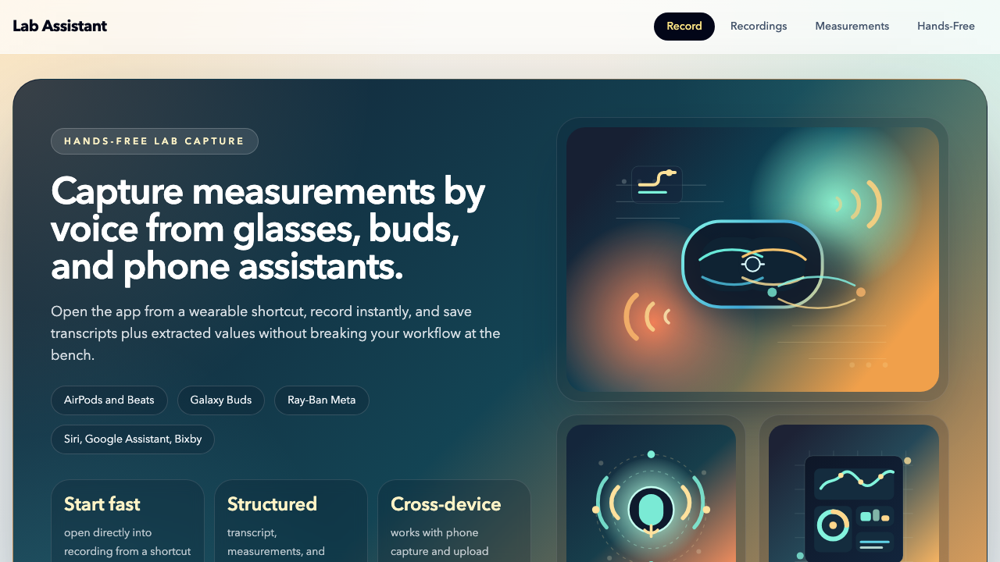

# Lab Assistant

Voice-powered measurement tracking for Ray-Ban Meta smart glasses.

Speak your lab measurements hands-free — Lab Assistant transcribes audio with Whisper, automatically extracts numeric values and units, and stores everything in a searchable database.

<p align="center">
  
</p>

## Features

- **Voice Recording** — Record audio directly in the browser or upload audio files (.wav, .mp3, .m4a, .webm, .ogg, .flac)
- **AI Transcription** — Whisper-powered speech-to-text (runs on CPU, no GPU needed)
- **Measurement Extraction** — Automatically detects values + units from transcripts (supports mL, mg, °C, pH, ppm, rpm, and many more)
- **Search & Filter** — Browse all measurements by unit, value range
- **CSV Export** — Download all measurements as a spreadsheet
- **PWA** — Installable as a standalone app with offline support
- **Hands-Free Deep Links** — `/record`, `/stop`, and `/assistant` routes for headset and assistant shortcuts
- **Cross-Platform Assistant Setup** — Works with Ray-Ban Meta, Siri, Samsung/Bixby, and Android assistant shortcut flows

## Tech Stack

| Layer    | Tech                                      |
|----------|-------------------------------------------|
| Frontend | React 19, Vite 7, Tailwind CSS 4          |
| Backend  | FastAPI, SQLAlchemy, Pydantic              |
| AI       | faster-whisper (CTranslate2, base model)   |
| Database | SQLite (configurable via `DATABASE_URL`)   |
| Deploy   | Docker, Railway                            |

## Quick Start

### Local Development

```bash
# Backend
cd backend
python -m venv venv && source venv/bin/activate
pip install -r requirements.txt
uvicorn main:app --reload --port 8000

# Frontend (separate terminal)
cd frontend
npm install
npm run dev
```

Open http://localhost:5173

### Docker

```bash
docker build -t lab-assistant .
docker run -p 8000:8000 lab-assistant
```

Open http://localhost:8000

## API Endpoints

| Method   | Endpoint                    | Description                        |
|----------|-----------------------------|------------------------------------|
| `GET`    | `/api/health`               | Health check                       |
| `POST`   | `/api/upload`               | Upload audio → transcribe → extract |
| `GET`    | `/api/recordings`           | List all recordings                |
| `GET`    | `/api/recordings/:id`       | Get recording with measurements    |
| `DELETE` | `/api/recordings/:id`       | Delete a recording                 |
| `GET`    | `/api/measurements`         | List measurements (filterable)     |
| `GET`    | `/api/export/csv`           | Export measurements as CSV         |

## Using with Headsets and Voice Assistants

Lab Assistant is designed for hands-free use from mobile headsets and phone assistants. Once deployed to a public URL, you can open it by voice and jump directly into recording mode.

### Setup

1. Deploy Lab Assistant to a public URL (see [Deploy to Railway](#deploy-to-railway) below)
2. Open the app URL once on your phone's browser to allow microphone permissions
3. Open the new `Hands-Free` tab in the app to copy the generated `open`, `record`, and `stop` URLs

### Voice Commands

For voice commands to work, you'll need a short custom domain (e.g. `lab.yourdomain.com`). You can add a custom domain in Railway under **Settings > Networking > Custom Domain**. Alternatively, use a free URL shortener.

**Ray-Ban Meta**
> "Hey Meta, open lab dot yourdomain dot com slash record"

**iPhone + AirPods**
Create Siri Shortcuts that open:
- `https://your-domain/record`
- `https://your-domain/stop`

**Samsung / Android**
Create a Bixby quick command, browser shortcut, or Android assistant routine that opens:
- `https://your-domain/record`
- `https://your-domain/stop`

### Typical Workflow

1. You're in the lab, hands full, wearing your Ray-Ban Meta glasses
2. Trigger your shortcut or assistant phrase to open `/record`
3. If the phone blocks automatic capture on first use, tap record once to grant access
4. Speak your measurements naturally:
   - *"Sample A, five point three milliliters at twenty-two degrees Celsius"*
   - *"Voltage reading is three point seven volts, current fifteen milliamps"*
   - *"Pressure holding steady at one hundred and two kilopascals"*
5. Stop recording — Whisper transcribes your audio and automatically extracts all values and units
6. Review, filter, and export your measurements later from the dashboard

### Supported Measurements

Lab Assistant recognizes **100+ physical units** across these categories:

| Category | Units |
|----------|-------|
| Volume | mL, μL, L, gal |
| Mass | μg, mg, g, kg, lb, oz, t |
| Length | nm, μm, mm, cm, m, km, in, ft, yd, mi |
| Temperature | °C, °F, K |
| Pressure | Pa, kPa, MPa, hPa, atm, bar, psi, mmHg, Torr |
| Power | mW, W, kW, MW, GW, hp |
| Energy | mJ, J, kJ, MJ, cal, kcal, Wh, kWh, eV |
| Electrical | mV, V, kV, μA, mA, A, Ω, kΩ, MΩ, pF, nF, μF, F, mH, H |
| Frequency | Hz, kHz, MHz, GHz, rpm |
| Force | N, kN, MN, lbf |
| Speed | m/s, km/h, mph, knot |
| Concentration | pH, M, ppm, ppb |
| Magnetic | T, mT, G, Wb |
| Sound | dB |
| Radiation | Sv, mSv, Gy, Bq |
| Light | lm, lx, cd |
| And more | Nm, L/min, %, mm², m², ha, cP, kg/m³, ... |

### Tips

- Speak clearly and include the unit name — "five megawatts" works, "five MW" also works
- You can use full names ("milliliters") or abbreviations ("mL")
- Spoken numbers work too — "twenty-two degrees Celsius" is extracted as `22 °C`
- Record multiple measurements in one go — they'll all be extracted automatically

## Deploy to Railway

1. Push to GitHub
2. Connect the repo in [Railway dashboard](https://railway.com/new)
3. Railway auto-detects the Dockerfile and deploys
4. Get your `*.up.railway.app` URL

Set `DATABASE_URL` env var for persistent storage (defaults to SQLite).

## Native Wrapper

The frontend now includes a Capacitor native shell for iOS and Android under `frontend/ios` and `frontend/android`.

### Mobile Backend Config

Native builds need an explicit backend URL because bundled web assets do not share origin with the FastAPI server.

1. Copy `frontend/.env.mobile.example` to `frontend/.env`
2. Set:

```bash
VITE_API_BASE_URL=https://your-domain.example/api
```

### Mobile Commands

```bash
cd frontend
npm run cap:sync
npm run cap:open:ios
npm run cap:open:android
```

### Native Permissions

- iOS microphone usage text is set in `frontend/ios/App/App/Info.plist`
- Android microphone permission is declared in `frontend/android/app/src/main/AndroidManifest.xml`

### Native Voice Commands

iOS native builds now expose App Shortcuts through App Intents in the app target. Example Siri phrases:

- `Start recording in Lab Assistant`
- `Stop recording in Lab Assistant`
- `Open Lab Assistant`
- `Open hands free setup in Lab Assistant`

Android native builds now declare Google Assistant App Actions in `frontend/android/app/src/main/res/xml/shortcuts.xml`.
Google Assistant usually prepends an invocation phrase to the custom query pattern, so examples are:

- `Open Lab Assistant and start recording`
- `Open Lab Assistant and stop recording`
- `Open Lab Assistant and open dashboard`
- `Open Lab Assistant and open hands free setup`

### Native Deep Link Scheme

The native shell also accepts the custom URL scheme:

- `labassistant://record`
- `labassistant://stop`
- `labassistant://assistant`

## Hands-Free Routes

- `/record` opens the app and attempts to start recording immediately
- `/stop` sends a stop signal to another recording tab
- `/assistant` opens the cross-platform setup screen with copyable links
- `/start` and `/finish` are shorter spoken aliases for `/record` and `/stop`

## Recommended Voice Phrases

Use distinct phrases when naming your phone shortcuts:

- `Lab Assistant Start`
- `Lab Assistant Finish`
- `Lab Assistant Dashboard`

## Project Structure

```
├── backend/
│   ├── main.py           # FastAPI app + static file serving
│   ├── database.py       # SQLAlchemy setup
│   ├── models.py         # Recording & Measurement models
│   └── extractor.py      # Regex-based measurement extraction
├── frontend/
│   ├── src/
│   │   ├── App.jsx       # Router with 3 tabs
│   │   ├── api.js        # API client
│   │   └── pages/        # Upload, Recordings, Measurements
│   └── public/           # PWA manifest, service worker, icons
├── Dockerfile            # Multi-stage build (Node + Python)
├── railway.json          # Railway config
└── README.md
```

## License

MIT
